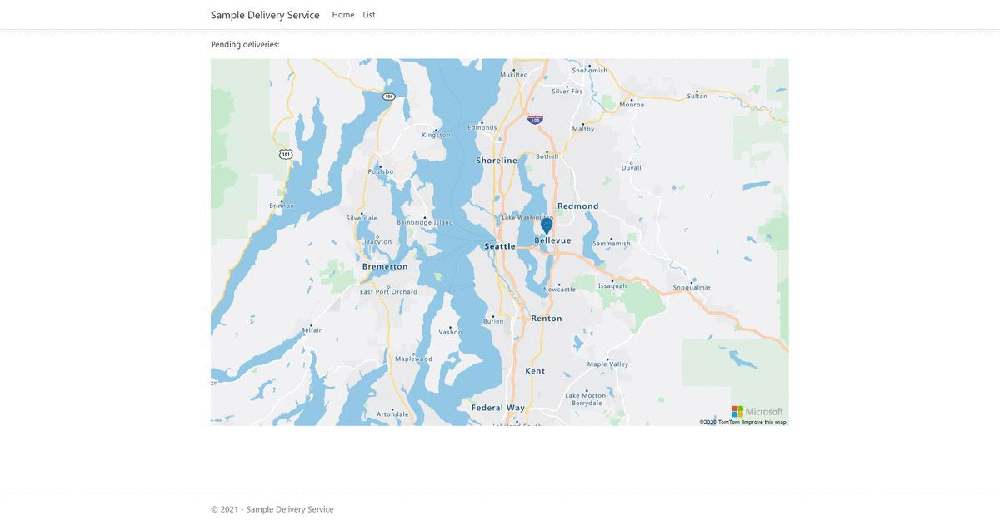
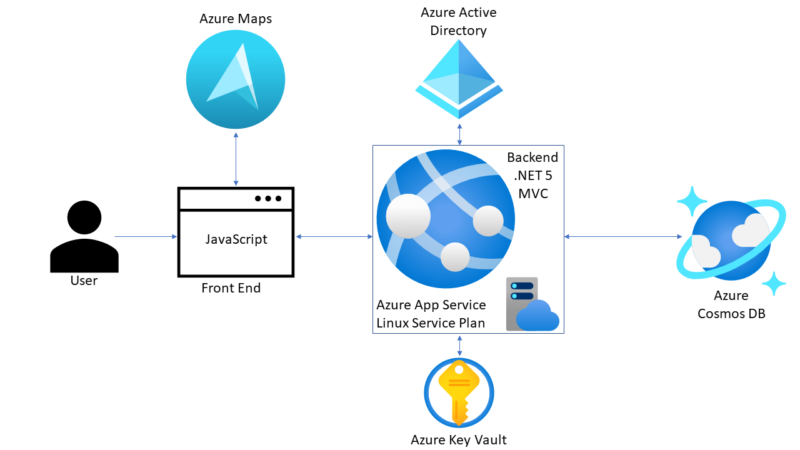

# Sample Delivery Service (Azure Maps Project)

## Overview

The objective of this sample application is to track orders, it stores the customer information with their address, you can edit the order to change the address or marked it as completed. In the home page you can see all the pending deliveries and in the list view you get a table of the orders and a map of which orders are completed and pending. For each order you can request a route from your location to the customer's address, see the details, edit or delete the order. When you create a new order you just need to enter the address and the application automatically will get the street number, city, state and zip code. In each view you will get a map showing the address.



## Description

This project is a sample delivery service application using [Azure Maps](https://azure.microsoft.com/services/azure-maps) Geospatial APIs to render maps in a web application. It is based on .[NET 5 MVC](https://dotnet.microsoft.com/download) as backend and JavaScript as front end. It connects to [Azure Cosmos DB](https://azure.microsoft.com/services/cosmos-db) with CRUD operations to store information about orders, [Azure Key Vault](https://azure.microsoft.com/services/key-vault) to store the application secrets and [Azure Active Directory](https://azure.microsoft.com/services/active-directory) to authenticate users and get the token for Azure Maps. Alternative you can use [shared Key authentication](https://docs.microsoft.com/en-us/azure/azure-maps/azure-maps-authentication#shared-key-authentication) for Azure Maps.

The following diagram shows the services and interaction of the different components in the application:



## Learn Azure Maps

Here are some resources to learn more about Azure Maps:

1. [Azure Maps Overview](https://azure.microsoft.com/services/azure-maps)
2. [Azure Maos Documentation](https://docs.microsoft.com/en-us/azure/azure-maps)
3. [Azure Maps Web SDK Samples](https://azuremapscodesamples.azurewebsites.net)

## Deployment

You can use the Azure Resource Manager template called **AzureDeploy.json** to deploy all the Azure services you will need to run the project. Including Azure Maps, Cosmos DB, Azure App Service plan on Linux and the Key Vault.

[](https://portal.azure.com/#create/Microsoft.Template/uri/https%3A%2F%2Fraw.githubusercontent.com%2Fdasanagu%2FSampleDeliveryService%2Fmain%2FSource%2FAzureDeploy.json)

## Project Setup

After you deploy the Azure resources in your subscription you will need to follow some steps to run the application:

1. You will need an [App Registration in your AAD](https://docs.microsoft.com/en-us/azure/azure-maps/how-to-secure-daemon-app) to authenticate Azure Maps. Follow this guide for creating it.
1. You will need to [create a secret in Azure Key Vault](https://docs.microsoft.com/en-us/azure/cosmos-db/access-secrets-from-keyvault) to store the Cosmos DB connection string.
1. You will need to replace the following lines in the code to include your Azure resources:
    1. Controllers > TokenController.cs > Line 22 & 23: include key vault URL and key vault secret for the Azure Maps.
    1. appsettings.json: Include Cosmos DB URL and Primary Key.
    1. Views > Shared > _layout.cshtml > Line 19: Specify Azure Maps Client Id.
    1. Startup.cs: Line 38: Update App Service URL in order to allow CORS policy in the application.
    1. Properties > launchSettings.json: For local debugging make sure Azure Key Vault URL and Azure Account are specified.

```json
Secret Format for Azure Maps Connection String
 "RunAs=App;AppId=<App Registration Id>;TenantId=<directory>.onmicrosoft.com;AppKey=<App Secret>"
```

## Contributing

This project welcomes contributions and suggestions. If you face an error or have a question please open an issue. Also take a look at the issues that are open to check what features are in the backlog.
